IMPORTANT ❗ ❗ ❗ Please remember to destroy all the resources after each work session. You can recreate infrastructure by creating new PR and merging it to master.


1. The goal of this phase is to create infrastructure, perform benchmarking/scalability tests of sample three-tier lakehouse solution and analyze the results using:
* [TPC-DI benchmark](https://www.tpc.org/tpcdi/)
* [dbt - data transformation tool](https://www.getdbt.com/)
* [GCP Composer - managed Apache Airflow](https://cloud.google.com/composer?hl=pl)
* [GCP Dataproc - managed Apache Spark](https://spark.apache.org/)
* [GCP Vertex AI Workbench - managed JupyterLab](https://cloud.google.com/vertex-ai-notebooks?hl=pl)

Worth to read:
* https://docs.getdbt.com/docs/introduction
* https://airflow.apache.org/docs/apache-airflow/stable/index.html
* https://spark.apache.org/docs/latest/api/python/index.html
* https://medium.com/snowflake/loading-the-tpc-di-benchmark-dataset-into-snowflake-96011e2c26cf
* https://www.databricks.com/blog/2023/04/14/how-we-performed-etl-one-billion-records-under-1-delta-live-tables.html

2. Authors:

   ***z9***
   
   Łukasz Stanecki
   
   Krzysztof Błażejewski
   
   Alina Yermakova

   ***[link to forked repo](https://github.com/LukeStanecki/tbd-workshop-1)***

3. Sync your repo with https://github.com/bdg-tbd/tbd-workshop-1.

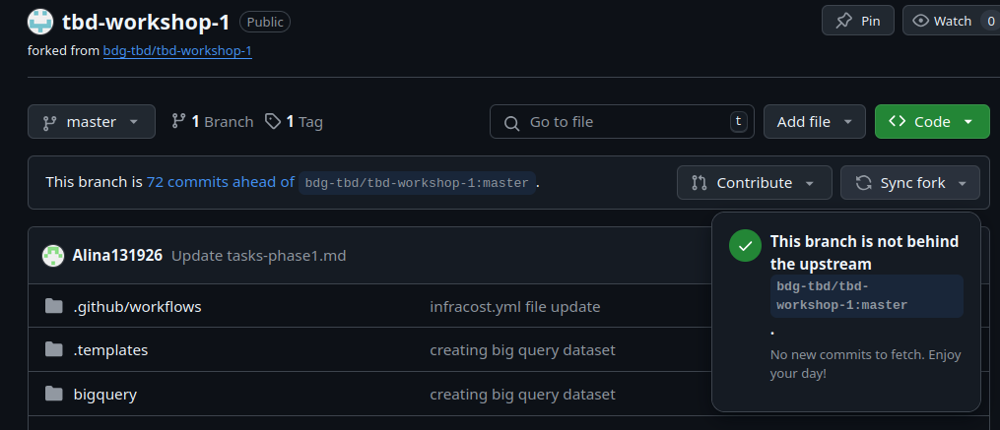

4. Provision your infrastructure.

    a) setup Vertex AI Workbench `pyspark` kernel as described in point [8](https://github.com/bdg-tbd/tbd-workshop-1/tree/v1.0.32#project-setup) 

    

    b) upload [tpc-di-setup.ipynb](https://github.com/bdg-tbd/tbd-workshop-1/blob/v1.0.36/notebooks/tpc-di-setup.ipynb) to 
the running instance of your Vertex AI Workbench

   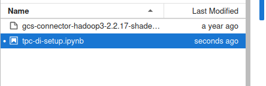

5. In `tpc-di-setup.ipynb` modify cell under section ***Clone tbd-tpc-di repo***:

   a)first, fork https://github.com/mwiewior/tbd-tpc-di.git to your github organization.

   b)create new branch (e.g. 'notebook') in your fork of tbd-tpc-di and modify profiles.yaml by commenting following lines:
   ```  
        #"spark.driver.port": "30000"
        #"spark.blockManager.port": "30001"
        #"spark.driver.host": "10.11.0.5"  #FIXME: Result of the command (kubectl get nodes -o json |  jq -r '.items[0].status.addresses[0].address')
        #"spark.driver.bindAddress": "0.0.0.0"
   ```
   This lines are required to run dbt on airflow but have to be commented while running dbt in notebook.

   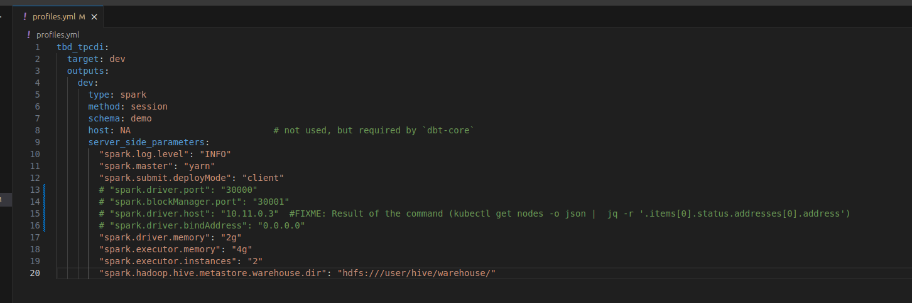

   c)update git clone command to point to ***your fork***.

 


6. Access Vertex AI Workbench and run cell by cell notebook `tpc-di-setup.ipynb`.

    a) in the first cell of the notebook replace: `%env DATA_BUCKET=tbd-2023z-9910-data` with your data bucket.

    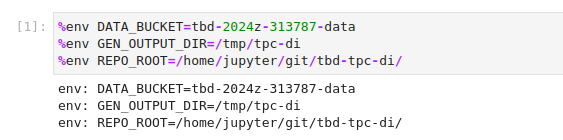


   b) in the cell:
         ```%%bash
         mkdir -p git && cd git
         git clone https://github.com/mwiewior/tbd-tpc-di.git
         cd tbd-tpc-di
         git pull
         ```
      replace repo with your fork. Next checkout to 'notebook' branch.

      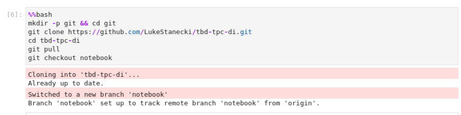

   
    c) after running first cells your fork of `tbd-tpc-di` repository will be cloned into Vertex AI  enviroment (see git folder).

    d) take a look on `git/tbd-tpc-di/profiles.yaml`. This file includes Spark parameters that can be changed if you need to increase the number of executors and
  ```
   server_side_parameters:
       "spark.driver.memory": "2g"
       "spark.executor.memory": "4g"
       "spark.executor.instances": "2"
       "spark.hadoop.hive.metastore.warehouse.dir": "hdfs:///user/hive/warehouse/"
  ```

   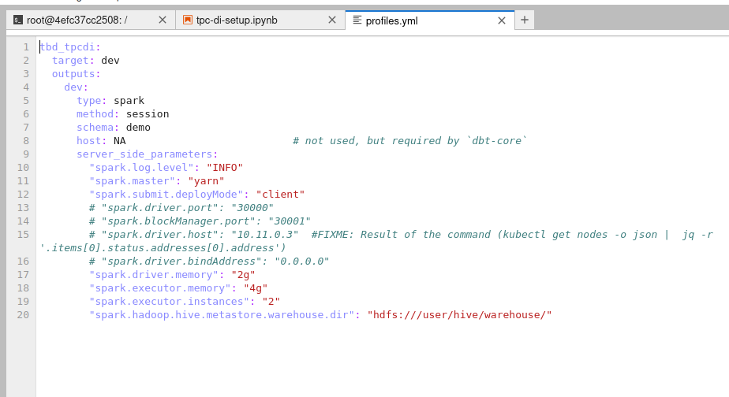

7. Explore files created by generator and describe them, including format, content, total size.

   ### Total size of generated files:
   - **Total size**: 9,6 GiB
   - **Content: created in 3 batches**
   - **Format**: CSV, TXT, XML.
   
   ### Data size based on data type:
   
   - **StatusType**: 3,6 KiB
   - **TaxRate**: 16,7 KiB
   - **Date**: 3,3 MiB
   - **Time**: 4,6 MiB
   - **BatchDate**: 88 B
   - **HR**: 39,6 MiB
   - **CustomerMgmt**: 298,1 MiB
   - **Customer**: 205,3 KiB
   - **Account**: 149,6 KiB
   - **Prospect**: 300,2 MiB
   - **Industry**: 2,7 KiB
   - **FINWIRE**: 1 GiB (Only in first batch)
   - **DailyMarket**: 3 GiB
   - **WatchHistory**: 1,3 GiB
   - **TradeSource**: 3,6 GiB
   - **TradeType**: 5 wierszy

   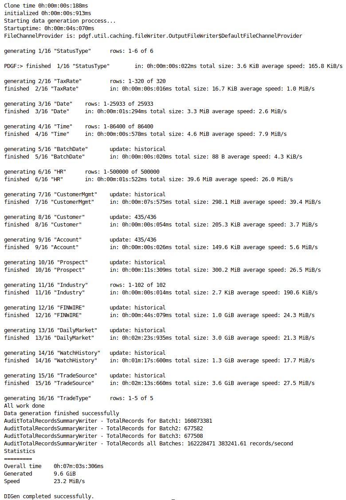
   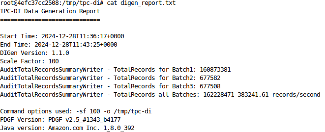

   [Full digen report](phase2_data/task_7/task7_digen_report.txt)

   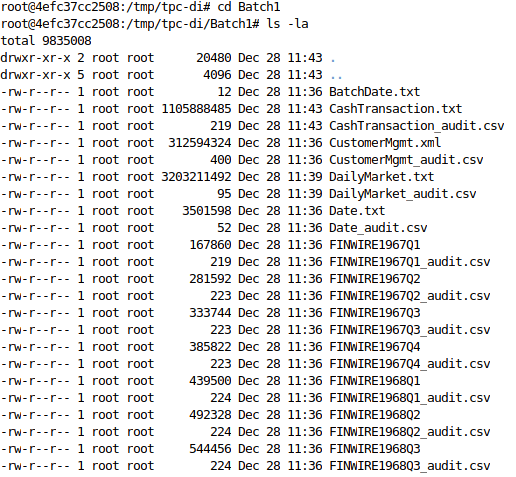

   [Full Batch1](phase2_data/task_7/batch1.txt)

   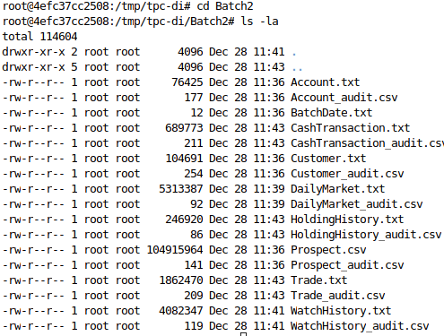

   [Full Batch2](phase2_data/task_7/batch2.txt)

   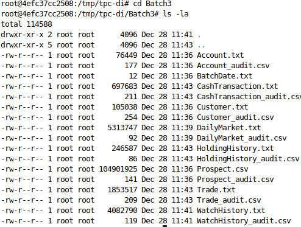

   [Full Batch3](phase2_data/task_7/batch3.txt)


8. Analyze tpcdi.py. What happened in the loading stage?

   The script is responsible for generating tables from data produced by the TPC-DI generator during the loading phase. A Spark session is initialized, and the required databases are created. Next each tables structure is defined and data is loaded to it directly form files. Data created this way, is then converted into DataFrames and saved in Parquet format. This causes the creation of tables in the 'digen' database.

   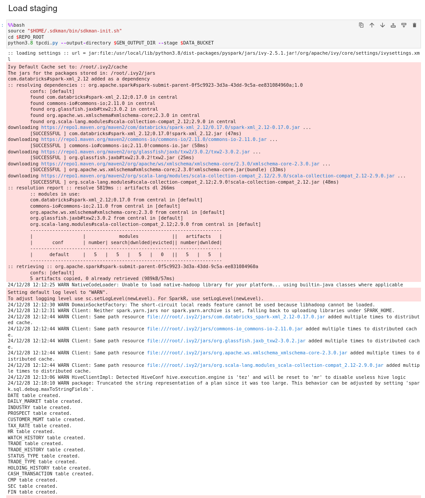

   [tpcdi.py file](https://github.com/LukeStanecki/tbd-tpc-di/blob/main/tpcdi.py)

9. Using SparkSQL answer: how many table were created in each layer?

   ### Tables in each layer:

   - **bronze**: 0
   - **default**: 0
   - **demo_bronze**: 17
   - **demo_gold**: 12
   - **demo_silver**: 14
   - **digen**: 17
   - **gold**: 0
   - **silver**: 0

   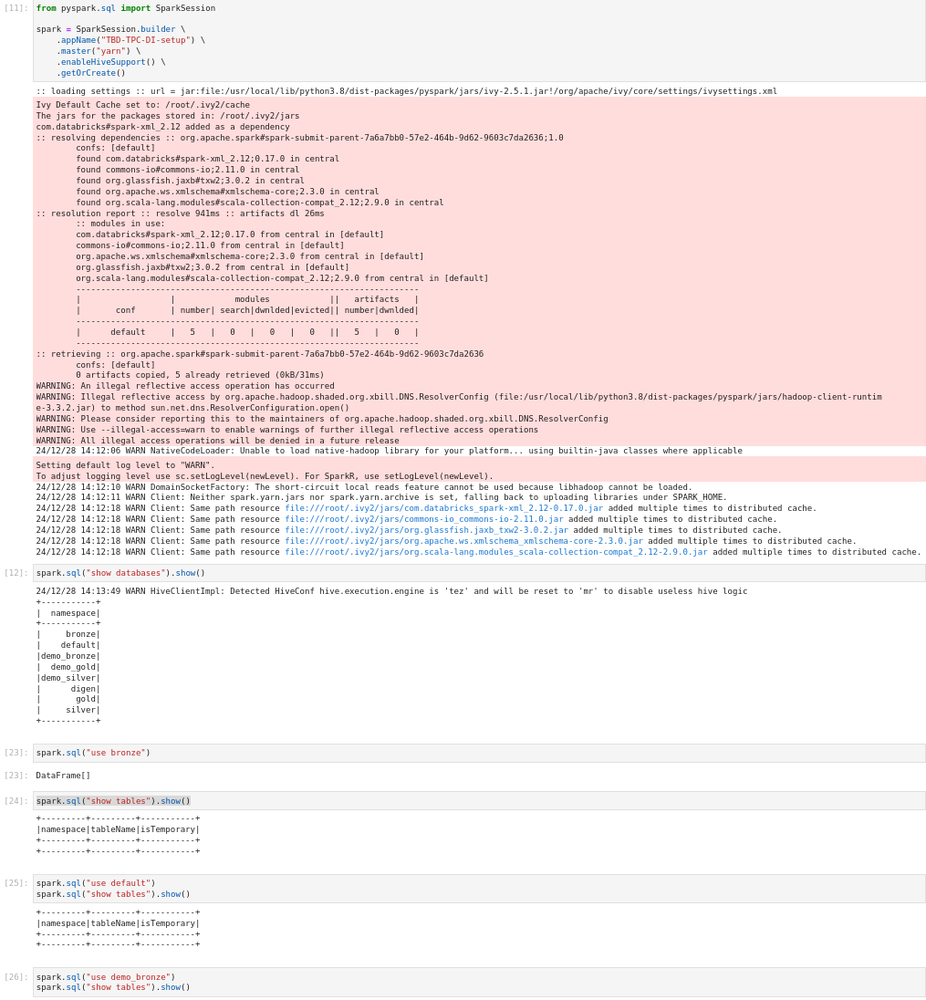
   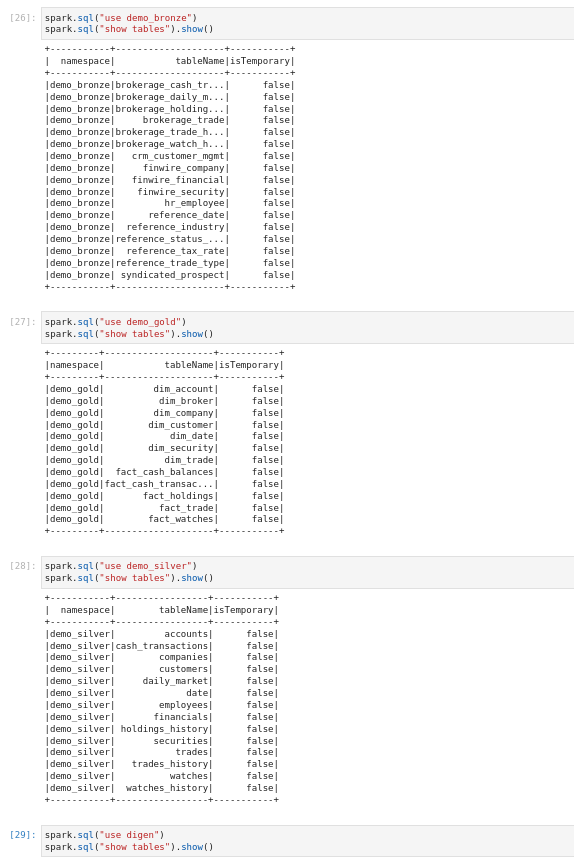
   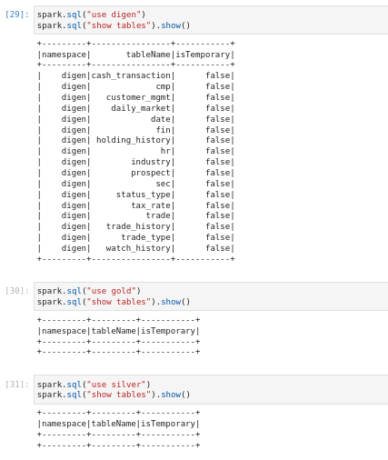

   [commands and outputs](phase2_data/task_9/task9.txt)

10. Add some 3 more [dbt tests](https://docs.getdbt.com/docs/build/tests) and explain what you are testing. ***Add new tests to your repository.***

   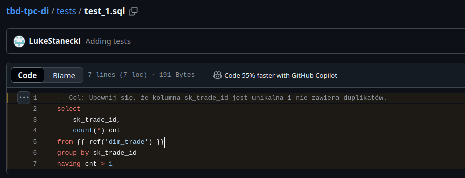
   https://github.com/LukeStanecki/tbd-tpc-di/blob/c735031d24f9496197c24cd080c41a7f275609d7/tests/test_1.sql#L1-L7

   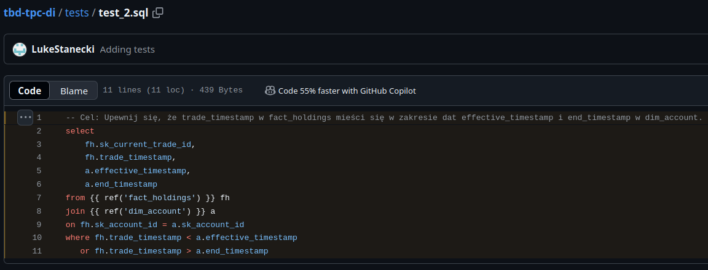
   https://github.com/LukeStanecki/tbd-tpc-di/blob/c735031d24f9496197c24cd080c41a7f275609d7/tests/test_2.sql#L1-L11

   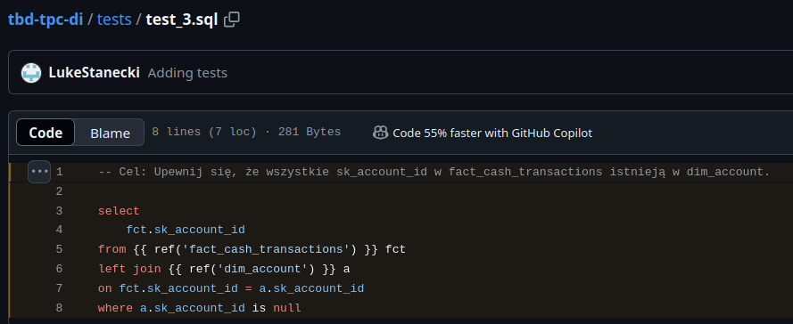
   https://github.com/LukeStanecki/tbd-tpc-di/blob/c735031d24f9496197c24cd080c41a7f275609d7/tests/test_3.sql#L1-L8

   ```
   15:46:55  Running with dbt=1.7.13
   15:46:55  Registered adapter: spark=1.7.1
   15:46:56  Found 44 models, 4 tests, 17 sources, 0 exposures, 0 metrics, 553 macros, 0 groups, 0 semantic models
   15:46:56  
   :: loading settings :: url = jar:file:/usr/local/lib/python3.8/dist-packages/pyspark/jars/ivy-2.5.1.jar!/org/apache/ivy/core/settings/ivysettings.xml
   Ivy Default Cache set to: /root/.ivy2/cache
   The jars for the packages stored in: /root/.ivy2/jars
   com.databricks#spark-xml_2.12 added as a dependency
   :: resolving dependencies :: org.apache.spark#spark-submit-parent-9555f617-ce7e-47e8-8f3e-7ccb929c76d9;1.0
      confs: [default]
      found com.databricks#spark-xml_2.12;0.17.0 in central
      found commons-io#commons-io;2.11.0 in central
      found org.glassfish.jaxb#txw2;3.0.2 in central
      found org.apache.ws.xmlschema#xmlschema-core;2.3.0 in central
      found org.scala-lang.modules#scala-collection-compat_2.12;2.9.0 in central
   :: resolution report :: resolve 489ms :: artifacts dl 16ms
      :: modules in use:
      com.databricks#spark-xml_2.12;0.17.0 from central in [default]
      commons-io#commons-io;2.11.0 from central in [default]
      org.apache.ws.xmlschema#xmlschema-core;2.3.0 from central in [default]
      org.glassfish.jaxb#txw2;3.0.2 from central in [default]
      org.scala-lang.modules#scala-collection-compat_2.12;2.9.0 from central in [default]
      ---------------------------------------------------------------------
      |                  |            modules            ||   artifacts   |
      |       conf       | number| search|dwnlded|evicted|| number|dwnlded|
      ---------------------------------------------------------------------
      |      default     |   5   |   0   |   0   |   0   ||   5   |   0   |
      ---------------------------------------------------------------------
   :: retrieving :: org.apache.spark#spark-submit-parent-9555f617-ce7e-47e8-8f3e-7ccb929c76d9
      confs: [default]
   ...
   WARNING: Illegal reflective access by org.apache.hadoop.shaded.org.xbill.DNS.ResolverConfig (file:/usr/local/lib/python3.8/dist-packages/pyspark/jars/hadoop-client-runtime-3.3.2.jar) to method sun.net.dns.ResolverConfiguration.open()
   WARNING: Please consider reporting this to the maintainers of org.apache.hadoop.shaded.org.xbill.DNS.ResolverConfig
   WARNING: Use --illegal-access=warn to enable warnings of further illegal reflective access operations
   WARNING: All illegal access operations will be denied in a future release
   Output is truncated. View as a scrollable element or open in a text editor. Adjust cell output settings...
   24/12/28 15:47:00 WARN NativeCodeLoader: Unable to load native-hadoop library for your platform... using builtin-java classes where applicable
   Setting default log level to "WARN".
   To adjust logging level use sc.setLogLevel(newLevel). For SparkR, use setLogLevel(newLevel).
   24/12/28 15:47:06 WARN DomainSocketFactory: The short-circuit local reads feature cannot be used because libhadoop cannot be loaded.
   24/12/28 15:47:07 WARN Client: Neither spark.yarn.jars nor spark.yarn.archive is set, falling back to uploading libraries under SPARK_HOME.
   24/12/28 15:47:14 WARN Client: Same path resource file:///root/.ivy2/jars/com.databricks_spark-xml_2.12-0.17.0.jar added multiple times to distributed cache.
   24/12/28 15:47:14 WARN Client: Same path resource file:///root/.ivy2/jars/commons-io_commons-io-2.11.0.jar added multiple times to distributed cache.
   24/12/28 15:47:14 WARN Client: Same path resource file:///root/.ivy2/jars/org.glassfish.jaxb_txw2-3.0.2.jar added multiple times to distributed cache.
   24/12/28 15:47:14 WARN Client: Same path resource file:///root/.ivy2/jars/org.apache.ws.xmlschema_xmlschema-core-2.3.0.jar added multiple times to distributed cache.
   24/12/28 15:47:14 WARN Client: Same path resource file:///root/.ivy2/jars/org.scala-lang.modules_scala-collection-compat_2.12-2.9.0.jar added multiple times to distributed cache.
   24/12/28 15:47:40 WARN HiveClientImpl: Detected HiveConf hive.execution.engine is 'tez' and will be reset to 'mr' to disable useless hive logic
   15:47:43  Concurrency: 1 threads (target='dev')
   15:47:43  
   15:47:43  1 of 4 START test fact_trade__unique_trade ..................................... [RUN]
   24/12/28 15:47:45 WARN SessionState: METASTORE_FILTER_HOOK will be ignored, since hive.security.authorization.manager is set to instance of HiveAuthorizerFactory.
   15:48:20  1 of 4 PASS fact_trade__unique_trade ........................................... [PASS in 37.15s]
   15:48:20  2 of 4 START test test_1 ....................................................... [RUN]
   15:49:28  2 of 4 PASS test_1 ............................................................. [PASS in 67.96s]
   15:49:28  3 of 4 START test test_2 ....................................................... [RUN]
   15:50:34  3 of 4 PASS test_2 ............................................................. [PASS in 65.50s]
   15:50:34  4 of 4 START test test_3 ....................................................... [RUN]
   15:50:50  4 of 4 PASS test_3 ............................................................. [PASS in 16.57s]
   15:50:50  
   15:50:50  Finished running 4 tests in 0 hours 3 minutes and 54.88 seconds (234.88s).
   15:50:51  
   15:50:51  Completed successfully
   15:50:51  
   15:50:51  Done. PASS=4 WARN=0 ERROR=0 SKIP=0 TOTAL=4
```

11. In main.tf update
   ```
   dbt_git_repo            = "https://github.com/mwiewior/tbd-tpc-di.git"
   dbt_git_repo_branch     = "main"
   ```
   so dbt_git_repo points to your fork of tbd-tpc-di. 

   https://github.com/LukeStanecki/tbd-workshop-1/blob/d4ec03b21355e1aab5453ec1e8b4c47dbb6e8221/main.tf#L1-L17

12. Redeploy infrastructure and check if the DAG finished with no errors:

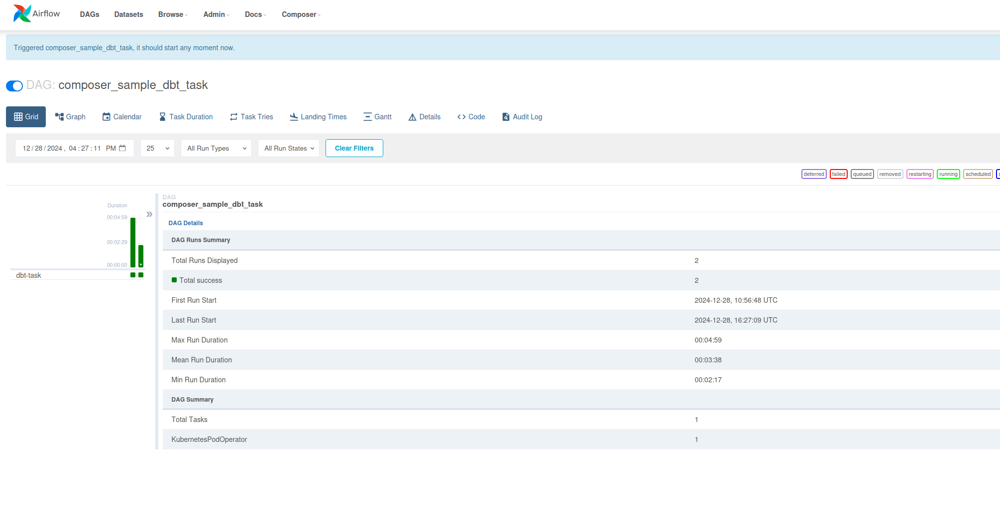
