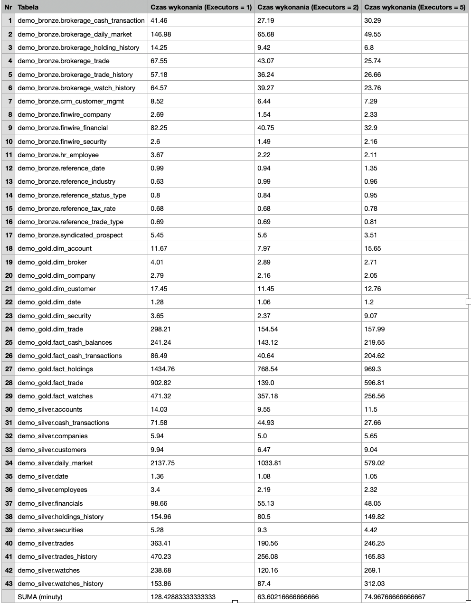
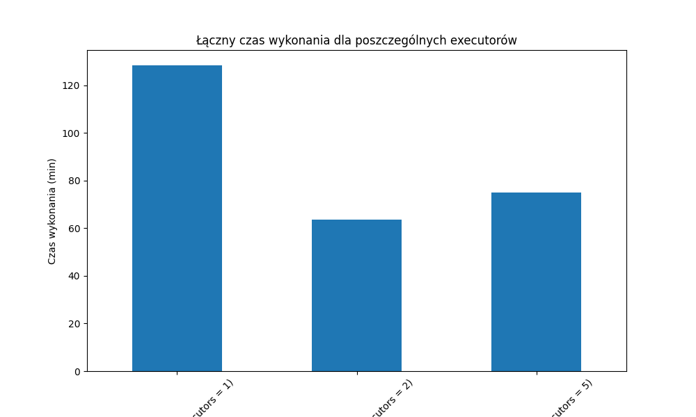
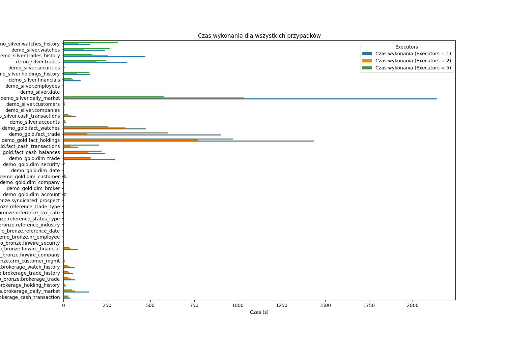

0. The goal of phase 2b is to perform benchmarking/scalability tests of sample three-tier lakehouse solution.

1. In main.tf, change machine_type at:

```
module "dataproc" {
  depends_on   = [module.vpc]
  source       = "github.com/bdg-tbd/tbd-workshop-1.git?ref=v1.0.36/modules/dataproc"
  project_name = var.project_name
  region       = var.region
  subnet       = module.vpc.subnets[local.notebook_subnet_id].id
  machine_type = "e2-standard-2"
}
```
 
and subsititute "e2-standard-2" with "e2-standard-4".

2. If needed request to increase cpu quotas (e.g. to 30 CPUs): 
https://console.cloud.google.com/apis/api/compute.googleapis.com/quotas?project=tbd-2023z-9918

3. Using tbd-tpc-di notebook perform dbt run with different number of executors, i.e., 1, 2, and 5, by changing:
```
 "spark.executor.instances": "2"
```

in profiles.yml.

4. In the notebook, collect console output from dbt run, then parse it and retrieve total execution time and execution times of processing each model. Save the results from each number of executors.

W tabeli poniżej są przedstawione wyniki czasowe dla 1,2,5 executorów. Wszystkie czasy wykonania są przedstawione w [s]; suma wszystkich czasów dla określonej liczby executorów jest przedstawiona w [min]



5. Analyze the performance and scalability of execution times of each model. Visualize and discucss the final results.

Porównanie sumy czasów wykonań dla 1 / 2 / 5 executorów jest przedstawione na poniższym wykresie



Porównania poszczególnych czasów wykonań dla 1 / 2 / 5 executorów są przedstawione na poniższym wykresie



Wnioski:

Analiza wyników pokazuje, że liczba executorów ma istotny wpływ na efektywność. Przy jednym executorze czas wykonania jest najdłuższy. Zwiększenie liczby executorów do dwóch znacząco poprawia wydajność, skracając czas wykonania prawie o połowę. Natomiast przy pięciu executorach czas wykonania nie skraca się proporcjonalnie, co może oznaczać, że zasoby są już wykorzystywane w pełni i dalsze zwiększanie liczby executorów nie przynosi proporcjonalnych korzyści.

Najdłuższy czas wykonania obserwowany jest dla tabel zawierających duże ilości danych, takich jak demo_gold.fact_holdings czy demo_silver.daily_market, co sugeruje, że to właśnie na tych operacjach warto skupić optymalizację. Z kolei tabele referencyjne (reference_*) wykonują się szybko, co wskazuje na ich niewielką złożoność obliczeniową.

Wykres łącznego czasu wykonania dla executorów pokazuje, że najlepszym rozwiązaniem w tym przypadku jest użycie dwóch executorów, które zapewniają największą redukcję czasu wykonania w stosunku do jednego executora. Przy większej liczbie executorów zysk wydajności jest mniejszy, co sugeruje, że skalowanie procesów nie jest liniowe i może być ograniczone przez inne czynniki, takie jak synchronizacja między procesami lub ograniczenia sprzętowe.

Podsumowując, optymalne rozwiązanie to zastosowanie dwóch executorów, szczególnie dla dużych tabel, gdzie różnica w czasie wykonania jest najbardziej zauważalna. 
