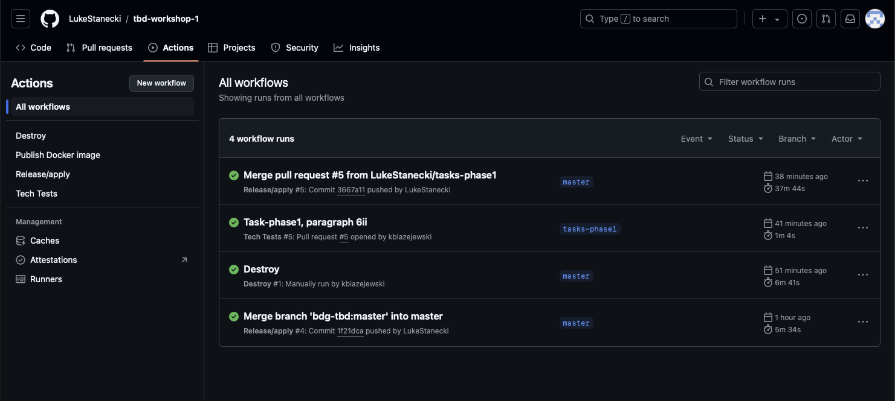
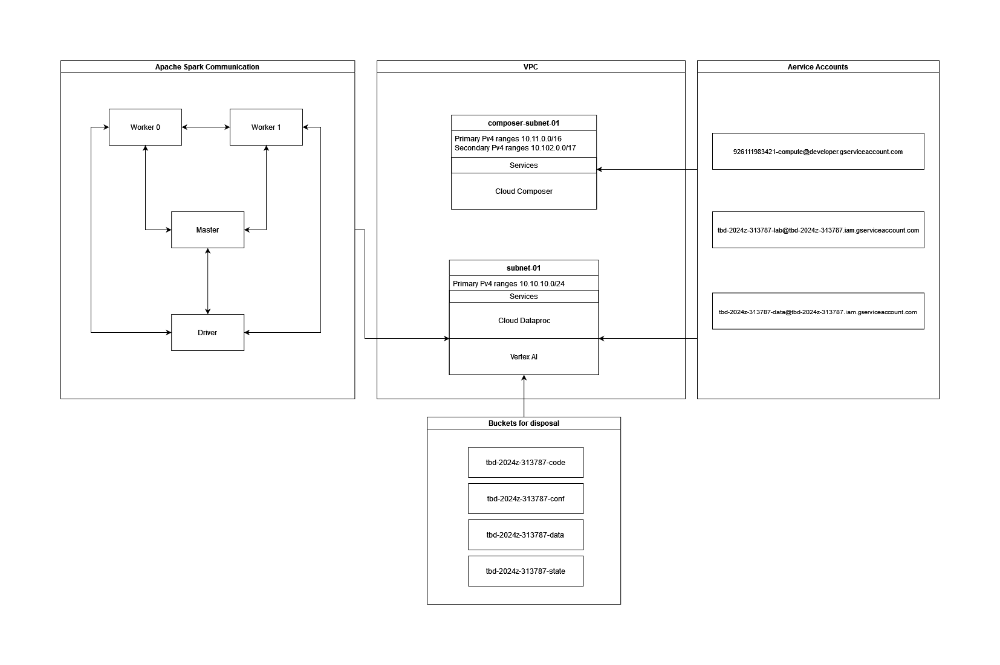
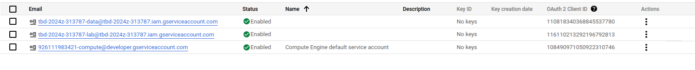
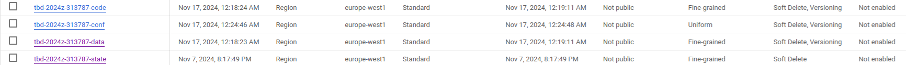
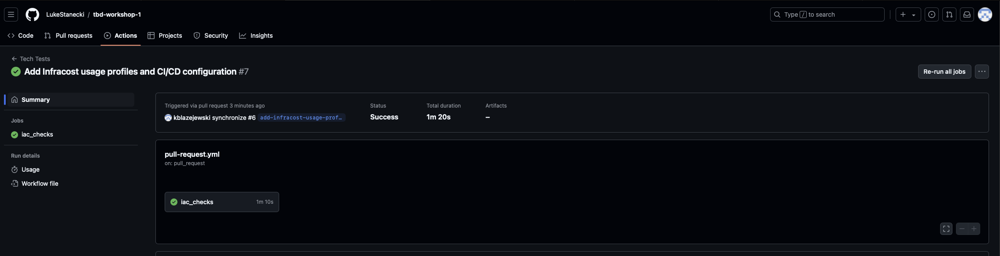
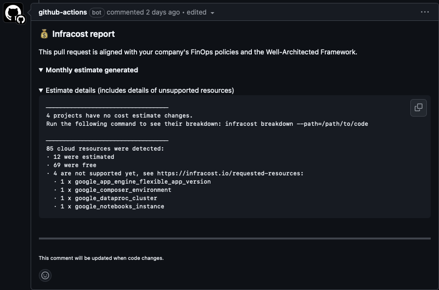
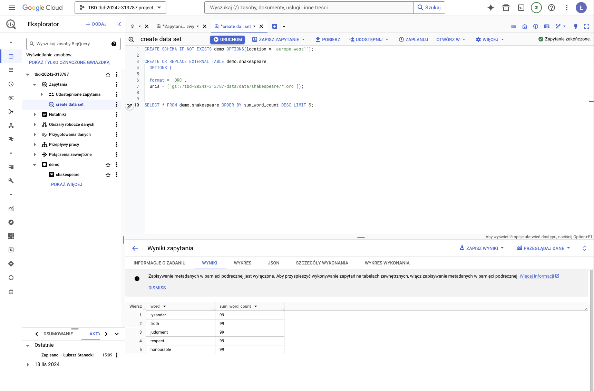
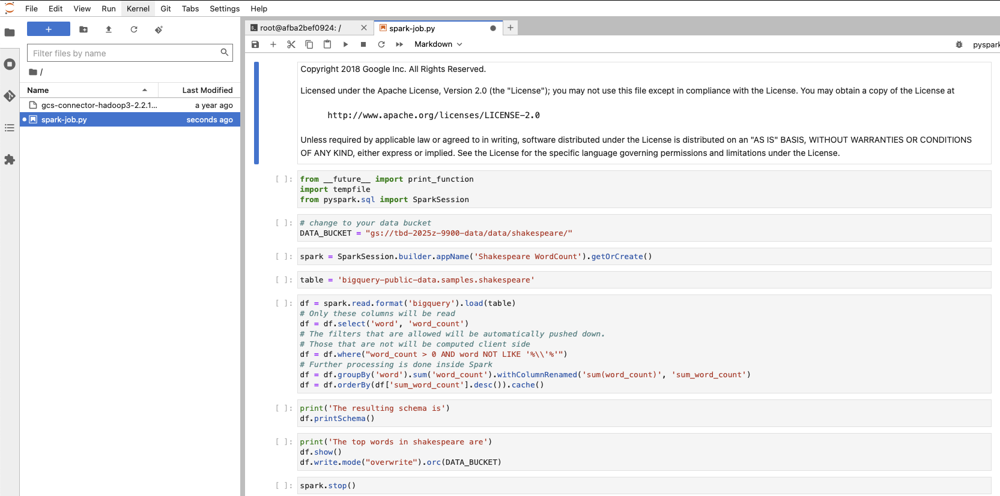
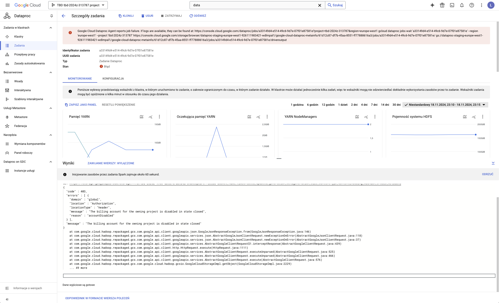
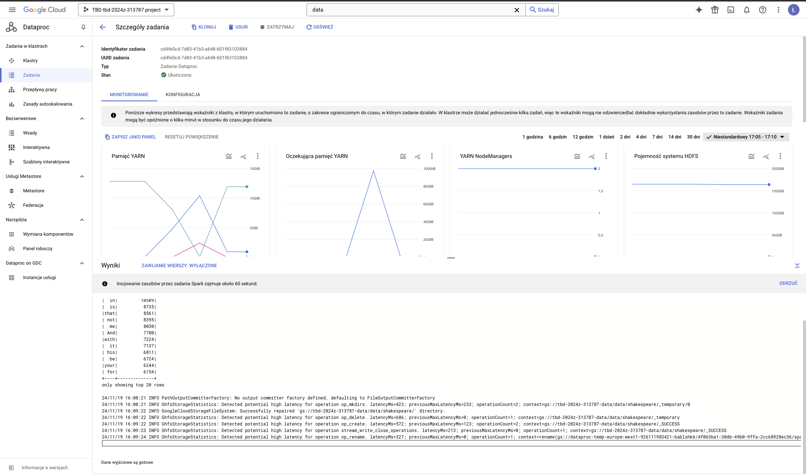

IMPORTANT ❗ ❗ ❗ Please remember to destroy all the resources after each work session. You can recreate infrastructure by creating new PR and merging it to master.
  


1. Authors:

   ***z9***

   ***[link to forked repo](https://github.com/LukeStanecki/tbd-workshop-1)***
   
2. Follow all steps in README.md.

3. Select your project and set budget alerts on 5%, 25%, 50%, 80% of 50$ (in cloud console -> billing -> budget & alerts -> create buget; unclick discounts and promotions&others while creating budget).

  

4. From avaialble Github Actions select and run destroy on main branch.
   
5. Create new git branch and:
    1. Modify tasks-phase1.md file.
    
    2. Create PR from this branch to **YOUR** master and merge it to make new release. 

    
        ***place the screenshot from GA after succesfull application of release***

        

6. Analyze terraform code. Play with terraform plan, terraform graph to investigate different modules.

    ***describe one selected module and put the output of terraform graph for this module here***
   
7. Reach YARN UI
   
   ## SSH Tunneling to the Cluster User Interface

    To access the YARN user interface in the cluster (port 8088), you need to configure an SSH tunnel that forwards the local port to the cluster’s port. The terminal command is:

    ```bash
    gcloud compute ssh tbd-cluster-m \
        --project=tbd-2024z-313787 -- \
        -L 1080:tbd-cluster-m:8088 -N -n
    ```

    
   
8.  Draw an architecture diagram (e.g. in draw.io) that includes:
    1. VPC topology with service assignment to subnets

    ***place your diagram here*** 

    2. Description of the components of service accounts

    
    - tbd-2024z-313787-data@tbd-2024z-313787.iam.gserviceaccount.com: Account that manages Cloud Composer and Dataproc clusters.
    - tbd-2024z-313787-lab@tbd-2024z-313787.iam.gserviceaccount.com: Account that provides the ability to manage the project infrastructure on Google Cloud via Terraform.
    - 926111983421-compute@developer.gserviceaccount.com: Account that manages the connection between Google Cloud and GitHub, including managing access tokens between them.
    
    3. List of buckets for disposal

    
    - tbd-2024z-313787-code: Bucket with code related to Apache Spark.
    - tbd-2024z-313787-conf: Bucket with configuration files.
    - tbd-2024z-313787-data: Bucket with data generated by the application.
    - tbd-2024z-313787-state: Bucket that retains the Terraform state.

    4. Description of network communication (ports, why it is necessary to specify the host for the driver) of Apache Spark running from Vertex AI Workbech
    
    - tbd-cluster-w-1: Worker (virtual machine) with IP: 10.10.10.2
    - tbd-cluster-w-0: Worker (virtual machine) with IP: 10.10.10.3
    - tbd-cluster-m: Master (virtual machine) with IP: 10.10.10.4
    - tbd-2024z-313787-notebook: JupyterLab Notebook (virtual machine) with IP: 10.10.10.5
  
    All machines are in subnet-01.
    Driver (port 30000): Port used for communication between the cluster and the driver.
    Block Manager (port 30001): Port used for data transfer within the cluster.

    In Apache Spark running in Vertex AI Workbench, it is necessary to specify the host for the driver, as this tells the Spark driver which worker nodes to send tasks to, retrieve data from, and how to communicate with the master node.
    This is required because the driver may run on a different machine or container than the other resources.
    
    
9.  Create a new PR and add costs by entering the expected consumption into Infracost. For all the resources of type: `google_artifact_registry`, `google_storage_bucket`, `google_service_networking_connection`
create a sample usage profiles and add it to the Infracost task in CI/CD pipeline. Usage file [example](https://github.com/infracost/infracost/blob/master/infracost-usage-example.yml) 

    ***place the expected consumption you entered here***
    https://github.com/LukeStanecki/tbd-workshop-1/blob/1b4586860788c12dd3ab35783f5c5b8eb3d24026/infracost-usage.yml#L1-L14 


    **Plik `.github/workflows/infracost.yml`:**

    ```yaml
    name: Tech Tests

    on: [pull_request]
    permissions: read-all

    jobs:
    iac_checks:
        runs-on: ubuntu-latest
        permissions:
        contents: read
        id-token: write
        pull-requests: write
        security-events: write
        actions: read

        steps:
        - uses: 'actions/checkout@v3'

        - uses: hadolint/hadolint-action@v3.1.0
            with:
            recursive: true
            verbose: true

        # Authenticate with Google Cloud using Workload Identity Federation
        - id: 'auth'
            name: 'Authenticate to Google Cloud'
            uses: 'google-github-actions/auth@v1'
            with:
            token_format: 'access_token'
            workload_identity_provider: ${{ secrets.GCP_WORKLOAD_IDENTITY_PROVIDER_NAME }}
            service_account: ${{ secrets.GCP_WORKLOAD_IDENTITY_SA_EMAIL }}

        - name: Set up Infracost
            uses: infracost/actions/setup@v2.1.0
            with:
            api-key: ${{ secrets.INFRACOST_API_KEY }}

        # Run Infracost to generate the baseline cost estimate
        - name: Generate Infracost baseline cost estimate
            run: |
            infracost breakdown --path="." \
                                --usage-file="infracost-usage.yml" \
                                --format=json \
                                --out-file=/tmp/infracost-base.json

        # Checkout PR branch again
        - name: Checkout PR branch
            uses: actions/checkout@v3

        # Run Infracost diff to compare PR changes with baseline
        - name: Generate Infracost diff
            run: |
            infracost diff --path="." \
                            --compare-to=/tmp/infracost-base.json \
                            --format=json \
                            --out-file=/tmp/infracost.json

        # Post Infracost diff as a comment in the PR
        - name: Post Infracost comment
            run: |
            infracost comment github --path=/tmp/infracost.json \
                                    --repo=$GITHUB_REPOSITORY \
                                    --github-token=${{secrets.GITHUB_TOKEN}} \
                                    --pull-request=${{github.event.pull_request.number}} \
                                    --behavior=update
    ```
    
    ***place the screenshot from infracost output here***
    
    

10. Create a BigQuery dataset and an external table using SQL
    

    ``` sql
    CREATE SCHEMA IF NOT EXISTS demo OPTIONS(location = 'europe-west1');

    CREATE OR REPLACE EXTERNAL TABLE demo.shakespeare
    OPTIONS (

    format = 'ORC',
    uris = ['gs://tbd-2024z-313787-data/data/shakespeare/*.orc']);


    SELECT * FROM demo.shakespeare ORDER BY sum_word_count DESC LIMIT 5;
    ```

    

   
    ***Why does ORC not require a table schema?***
    ORC (Optimized Row Columnar) is a self-describing columnar storage format, which means that it stores the schema and metadata directly within the file itself. This design eliminates the need for an external schema definition during the file creation or reading process. 
  
11. Start an interactive session from Vertex AI workbench:

    ***place the screenshot of notebook here***
    
   
12. Find and correct the error in spark-job.py

    ***describe the cause and how to find the error***
    The error before changes:
    

    Path to bucket were changed:
    https://github.com/LukeStanecki/tbd-workshop-1/blob/3f170219e3ea93b907d2bd1893db0e2ddc618015/modules/data-pipeline/resources/spark-job.py#L20-L22


    


13. Additional tasks using Terraform:

    1. Add support for arbitrary machine types and worker nodes for a Dataproc cluster and JupyterLab instance

    ***place the link to the modified file and inserted terraform code***

    Generaly, support for arbitrary machine types and worker nodes are already implemented.

    https://github.com/LukeStanecki/tbd-workshop-1/blob/3f170219e3ea93b907d2bd1893db0e2ddc618015/modules/dataproc/variables.tf#L17-L21

    If we would like to change the `machine type` we would change variable to use a diferent machine type, for example:

    ``` tf
    variable "machine_type" {
    type        = string
    default     = "e2-standard-4"
    description = "Machine type to use for both worker and master nodes"
    }
    ```
    
    2. Add support for preemptible/spot instances in a Dataproc cluster

    ***place the link to the modified file and inserted terraform code***

    https://github.com/LukeStanecki/tbd-workshop-1/blob/3f170219e3ea93b907d2bd1893db0e2ddc618015/modules/dataproc/variables.tf#L28-L32

    https://github.com/LukeStanecki/tbd-workshop-1/blob/3f170219e3ea93b907d2bd1893db0e2ddc618015/modules/dataproc/main.tf#L52-L61
    
    3. Perform additional hardening of Jupyterlab environment, i.e. disable sudo access and enable secure boot
    
    ***place the link to the modified file and inserted terraform code***

    https://github.com/LukeStanecki/tbd-workshop-1/blob/3f170219e3ea93b907d2bd1893db0e2ddc618015/modules/vertex-ai-workbench/main.tf#L68-L71

    https://github.com/LukeStanecki/tbd-workshop-1/blob/3f170219e3ea93b907d2bd1893db0e2ddc618015/modules/vertex-ai-workbench/main.tf#L74-L78

    4. (Optional) Get access to Apache Spark WebUI

    ***place the link to the modified file and inserted terraform code***

    https://github.com/LukeStanecki/tbd-workshop-1/blob/3f170219e3ea93b907d2bd1893db0e2ddc618015/modules/dataproc/main.tf#L15-L17